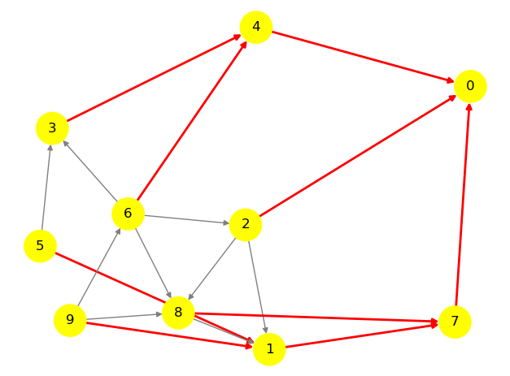

# Hierarchical approach for leader election in dynamic ad hoc networks  

Mathieu SERANDOUR

## Abstract  

We present a hierarchical approach to leader election algorithms in large scale dynamic networks, and bring a proof of concept algoritm based on the link reversal method.
The goal of the approach is to build a tree of leaders: electing one global leader and multiple local leaders. The idea is to avoid situations in which every topology change causes a global leader reelection. Instead, only the local leader may be subject to change.  


## I. Introduction - Leader election problem in ad hoc systems  


The principle of leader election in a distributed network is the delegation of a task to be done by one node only, therefore not distributed. It is generally needed in a context in which distributed processes must perform a collective function and need a single process to act as a synchronizing leader. In distributed systems, whether wired or wireless, leader election is a helpful building piece, especially when failures are possible. The whole problem behind leader election is for all nodes to agree on which one is selected. As for peer to peer internet networks, any node can connect to any other. Then, the topology of the network is flexible.	In a mobile ad hoc network however, messages are sent between two nodes either directly through a wireless link or through a series of wireless links that include one or more intermediary nodes. Only pairs of nodes that are physically adjacent to one another can directly communicate with one another. When two nodes become too distant from each other, the wireless link fails. In the same way, wireless links can be created dynamically when nodes that were previously too far apart to communicate move in order to put themselves in each other's broadcast range. The topology is subject to changes, abruptly and frequently. The problem in these kind of networks is to maintain at all time the communication between a leader and every other node, despite of topological changes, and reelecting a leader when it is no longer reachable by every node.


## II. From simple routing algorithm to LE solution in dynamic networks  


A class of leader election algorithms is based on height-based routing algorithms [3][4]. This sections aims to describe the idea of height-based routing algorithms and how it led to leader election algorithms in dynamic networks. The goal of a routing algorithm is to create a directed acyclic graph (DAG) in which only the only sink is the destination. A sink node is a node that has no outgoing links. Within this kind of networks, the outgoing links are directions to the destination. 	Gafni and Bertsekas [1] introduced two synchronous routing algorithms:  

- Full link reversal: At every round, each node other than the destination which became a sink reverses all its links, meaning that all of its ingoing links become outgoing.  

- Partial link reversal: This algorithm works in the same way as the full link reversal one, except that every node i other than the destination keeps a list of its neighboring nodes' j that have reversed the direction of the corresponding links (i, i). At each iteration each node i that has no outgoing link reverses the directions of the links (i, j) for all j which do not appear on its list, and empties the list. If not such j exists (i.e., the list is full), node i reverses to the directions of all incoming links and empties the list.  


Gafni and Bertsekas [1] also presented two height-based algorithms which are equivalent to the above algorithms. The main idea is for every node to maintain a height vector composed on one or multiple values. Height values are compared lexicographically. For each node i, the link (i,j) is defined as ingoing if and only if the the height of j is inferior to the height of i. When a node updates its height, it sends an update message to all of its peers, for every node to know the state of its peers.

- Full link reversal: the height is in the form $h_i=(a_i,i)$. Where $i$ is an unique identifier. $a_i$ is initially $0$ for every node. The purpose of putting an unique identifier in the height vector is to break the symmetry during the initialization. When a node becomes a sink at the _k_ th iteration, it updates its $a_i$ value:  
$$a_i^{k+1}=\max_{j \text{ neighbor of } i}{a_j^k} + 1$$

- Partial link reversal: the height is in the form $h_i=(a_i,b_i,i)$. The value $a_i$ follow the same rules as above. $b_i$ is initially set to $0$, and when a node becomes a sink at the _k_ th iteration, it updates its $b_i$ value:  


if there exists a neighbor $j$ of $i$ with $a_i^{k+1} = a_j^k$:  

$$ b_i^{k+1} =  \min_{j \text{ neighbor of } i}{b_j^k} + 1$$


Otherwise,
$$ b_i^{k+1} = b_i^{k}$$


Based on the same principle, the Temporally-Ordered Routing Algorithm (TORA) uses 5-values heights $h_i = (\tau_i, oid_i,r_i, \delta_i, i)$, targets dynamic networks and is also synchronous [2]. As the Gafni and Bertsekas algorithm, this one also constructs a direction oriented directed acyclic graph, but it also reacts to topological changes. Furthermore, it allows every node in the network to detect if the destination is reachable. The protocol’s reaction is structured as a temporally-ordered sequence of diffusing computations, each computation consisting of a sequence of directed link reversals.  

The first three values in the height vector $\tau_i, oid_i, r_i$ represent a reference level. An unreflected reference level is created everytime a node other than the destination becomes a sink due to a link failure. $\tau_i$ represents a timestamp of this event, $oid_i$ is the identifier of the node that created the reference level, and $r_i$ is a boolean value used to divide each of the unique reference levels into two unique sub-levels. If a node becomes a sink not because of a link failure, and its current reference level is an unreflected one ($r_i=0$), 
it starts a reflection meaning that it swaps its $r_i$ value. Its purpose is to distinguish the original reference level and its corresponding, higher reflected reference level. The fourth value $\delta_i$ is a number that grows with the distance to the destination with respect with the reference level. The last value is a unique identifier. When a node $i$  becomes a sink again because of a link reversal, and all of its neighbors have the same reference reflected level with $oid=i$ (meaning that the unreflected reference level was previously created by $i$ and got reflected before spreading back to $i$), then the node $i$ know for sure that it cannot reach the destination node.  

Malpani et al. proposed a synchronous leader election algorithm mobile ad oc networks based on TORA. The idea is to have the current leader as the destination, and for every node to elect itself when it detects that the current leader is no longer reachable. To do so, a 6th height component is introduced:    

$$h_i = (lid_i, \tau_i, oid_i,r_i, \delta_i, i)$$

$lid_i$ represents the id of the current leader. If the network is no longer connected, a leader is elected in each connected component.
If a node detects that there is no leader in its connected component, it declares itself as the leader and propagates the information to the other nodes in the new component. 

When two components meet due to the formation of a new link, the leader of one of the components which has the lower identification number eventually becomes the leader of the new component.

- Ingram's algorithm upgrade


## III. Hierarchical approach

In this project we studied the doability of a hierarchical approach to leader election. The idea of this approach is to split the network into small partitions, elect a leader among each partition, then create super partitions, elect a leader for per super partition, etc. We split the problem into three different parts:  

- A. Partitioning the network  
- B. electing one leader per partition
- C. creating routes between the leaders of the new created partitions

Once we have these three parts working, we can run them $n$ times with right parameters to build a $n$ level hierarchical structure. 

Because of timing constraints, we only focus on B and C. Efficient distributed energy-efficient clustering algorithms exist [5] and could be used to solve problem A in our case. We also focus on static networks but our approach should be generalizable to dynamic networks.


### Problem B

We introduced partition unique identifiers $pid_i$. We suppose that the algorithm solving problem A can produce such an identifier. This way, a node can easily detect whether or not a neighbor of his is in its partition. Problem B can then be solved using any leader election algorithm by only considering neighbors within the same partition in the process.


We chose to use the algorithm by Malpani et al. [3] to solve problem B. As their algorithm, our hierarchical one is also synchronous. Some improvement might be possible to make it asynchronous, for example by using the algorithm by Ingram et al. [4] instead. In this case, an asynchronous clustering algorithm should also be used.

### Problem C

The goal of problem C is for any partition leader to be able to send a message to the leader of any neighbor partition of his. We define a partition $p_j$ as a neighbor of partition $p_i$ if there exists a link between a node within $p_i$ and a node within $p_j$. 

Problem B gives that any node in a partition is capable of sending a message to its local leader. Therefore, solving problem C only requires for the leader of partition $p_i$ to be able to send a message to one node within every neighbor partition $p_j$. 

One way to solve Problem C is to create the primitive for any node $n_i$ and a partition with identifier $pid_i$ within the same connected component:  

$$route(n_i, pid_i)$$

This primitive allows any node to send a message to a node in any partition within the same connected component. 

A way to achieve that is to use a height based algorithm, similar to a leader election one. For example, an algorithm similar to the problem B one could be applied on the set of nodes:
$$ \{n_k \in p_i\} \cup \{n_k \in p_j \text{ neighbor of a node in } p_i\}$$

The algorithm would have to be modified in such a way that the leader would have to be in $\{n_k \in p_j \text{ neighbor of a node in } p_i\}$ and would represent the representative of $p_i$ in $p_j$. This way, a node in $p_i$ can send a message to the representative (as a representative oriented directed acyclic graph is generated) which will be able to redirect it to its partition leader.

The problem with this approach is that it is not very flexible: Consider that there are two links between $p_i$ and $p_j$ :  $n_k, n_l \in p_j$ neighbors of nodes in $p_i$. Consider that $n_k$ is elected as the representative of $p_i$ in $p_j$, and its link to $p_i$ fails. Then a reelection must be done.

Instead, another height based algorithm is possible using a single height value $d_{k,i}$ for node $n_k$ to reach $p_i$. $d_{k,i}$ is set to 1 for every node who has a neighbor in $p_i$, and represents the distance for every node from itself to the nearest node in $p_i$. Everytime a node updates its height $d_{k,i}$ to $p_i$, it broadcasts it to its neighbors. When a node $n_k$ detects that a neighbor of his $n_l$ is at a distance:
$$d_{l,i} < d_{k,i} - 1$$  

Then it updates its own distance to:  

$$d_{k,i} < d_{l,i} + 1$$ 

We could also use a two values height algorithm like Gafni and Bertsekas [1] to be addaptive to dynamic networks. 


## IV. Implementation  

The only messages that are sent are update messages, as for the height based algorithms [1][2][3][4]. The introduced fields are $pid_i$ and the multiple partition heights $H_i$. These fields are sent in update messages as well.

We wrote a proof of concept application in the python programming language, using an object oriented framework called _Pykka_ for simulating distributed networks on the actor model. As the `list` type is compared lexicographically in python, we used the `list[6]` type for height values.

The goal of this proof of concept application is to run tests and validate the doability of the hierarchical approach. Tests are presented in the next section.

Figure 1 shows the definition of variables for one actor. `peers` is a dictionary mapping unique identifiers to actor references of the neighbors of the actor. As we introduced in the preceding section, global partition heights are stored in the ̀`heights` variable. It is a dictionnary mapping a unique partition identifier to a height vector. `self.heights[self.pid]` represents the Malpani et al. algorithm 6 values height, and the other stored heights have only one value. 

```
Height = list[6]


class Actor:
    peers: dict
    heights: dict # partition id -> Height
    pid: int 
    peer_heights: dict # node id: {partition id -> Height}
    peer_pids: dict# {node id -> partition id}
```
Figure 1

```
    def update_message(self, id, heights, pid):
        sink = self.is_sink()
        
        heights = heights.copy()
        
        self.peer_heights[id] = heights
        self.peer_pids[id] = pid
        
        need_broadcast = False
        
        if pid != self.pid:
            updated = False
            for p in heights.keys():
                h = heights[p]
                if isinstance(h, list):
                    h = 0
                    
                if p == self.pid: 
                    continue
                    
                if p in self.heights.keys() and self.heights[pid] <= h + 1:
                    continue
                
                updated = True
                print(self.heights[self.pid][-1], "learn about", p)
                self.heights[p] = h + 1
                    
                
            if updated:
                self.broadcastUpdate()
            return        
        else:
            # pj knows some partitions, let us learn how to contact them
            for p in heights.keys():
                if p != self.pid:
                    if not p in self.heights.keys() or self.heights[p] > heights[p] + 1:
                        self.heights[p] = heights[p] + 1
                        need_broadcast = True

        if heights[pid][0] != self.heights[pid][0]:
            # When node i receives an Update message 
            # from neighboring node j such that lidj != lidi: 
            # if lidi > lidj or (oidi = lidj and ri = 1)
            if (self.heights[pid][0] > heights[pid][0] or 
               (self.heights[pid][2] == heights[pid][2] and self.heights[pid][2] == 1)):
                self.heights[pid] = [heights[pid][0], 0, 0, 0, heights[pid][4]+1, self.heights[pid][-1]]
                need_broadcast = True
            if not sink:
                h = self.heights[pid]  
                if self.update_height(heights[pid][-1]):
                    need_broadcast = True
                else:
                    assert h == self.heights[self.pid]
        
        if need_broadcast:
            self.broadcastUpdate()
```
Figure 2


## V. Tests

We used 4 parameters to procedurally create the network graph:
- `k`: number of partitions
- `N`: nodes per partition
- `p`: conectivity parameter in a partition
- `P`: conectivity parameter between partitions

There are exactly `N` nodes within each partition, and exactly `k` partitions. The entier network contains $kN$ nodes. Each node is connected to at least $1$ other node in its partition, and $2p$ in average. 

Every partition is connected to at least one node in another partition, and $2P$ in average.


The every drawn graphs, the nodes in the same partition are drawn in the same color. Within a partition, edges are directed from a node with a higher local height to a node with a lower  local height. The output edge of a node to its peer with minimum height is drawn in red, while the others are grey. 


_Figure 3_ shows the result of the algorithm using only a single partition. It is equivalent to the Malpani et al. algorithm. We can see that node 0 was elected as the leader of the partition.

_Figure 4_ shows the result of the algorithm using four partitions. It is equivalent to the result of Malpani et al. algorithm on each partition. We can see that node 0 was elected as the leader of the yellow partition, 4 is elected in the cyan partition and 8 is elected in the green partition. Interpartition edges are represented in bidirectionnal blue arrows. It shows how problem B is solved.

_Figure 5_ takes the same nodes and partitioning as in _Figure 4_, but shows in green links the directed acyclic graph oriented the yellow partition. Every edge goes from a node $k$ with global yellow partition height $d_{k,\text{yellow}}$ to a node $l$ with global yellow partition height $d_{l,\text{yellow}} < d_{k,\text{yellow}}$. The same kind of graphs are drawn on _figure 6_ and _figure 7_ for the cyan and green partition being the target.

<br/>


Figure 3: N = 10, k = 1, p = 2, P = 0


Figure 4: N = 4, k = 3, p = 2, P = 1


Figure 5: N = 4, k = 3, p = 2, P = 1, green links in direction to the yellow partition


Figure 6: N = 4, k = 3, p = 2, P = 1, green links in direction to the green partition


Figure 7: N = 4, k = 3, p = 2, P = 1, green links in direction to the cyan partition

<!--
## VI Discussion
- Cost of partitioning?
- Cost of level 2 routing?

- is this approach relevent? Does it bring better results than the algorithm by Malpani et al.?

-->


## VI. References

[1] E. Gafni and D. Bertsekas. Distributed algorithms for generating loop-free routes in networks with frequently changing topology. IEEE Trans. on Communications, C-29(1):11–18, 1981.

[2] V. Park and M. S. Corson. A highly adaptive distributed routing algorithm for mobile wireless networks. In Proc. INFOCOM ’97, pp. 1405–1413, 1997

[3] N. Malpani, J. Welch, and N. Vaidya. Leader election algorithms for mobile ad hoc networks. In Proc. ACM DIAL-M Workshop, pp. 96–104, 2000.

[4] R. Ingram, P. Shields, J. E. Walter and J. L. Welch, "An asynchronous leader election algorithm for dynamic networks," 2009 IEEE International Symposium on Parallel & Distributed Processing, 2009, pp. 1-12, doi: 10.1109/IPDPS.2009.5161028.

[5] Li Qing, Qingxin Zhu, Mingwen Wang, Design of a distributed energy-efficient clustering algorithm for heterogeneous wireless sensor networks, Computer Communications, Volume 29, Issue 12, 2006, Pages 2230-2237, ISSN 0140-3664.